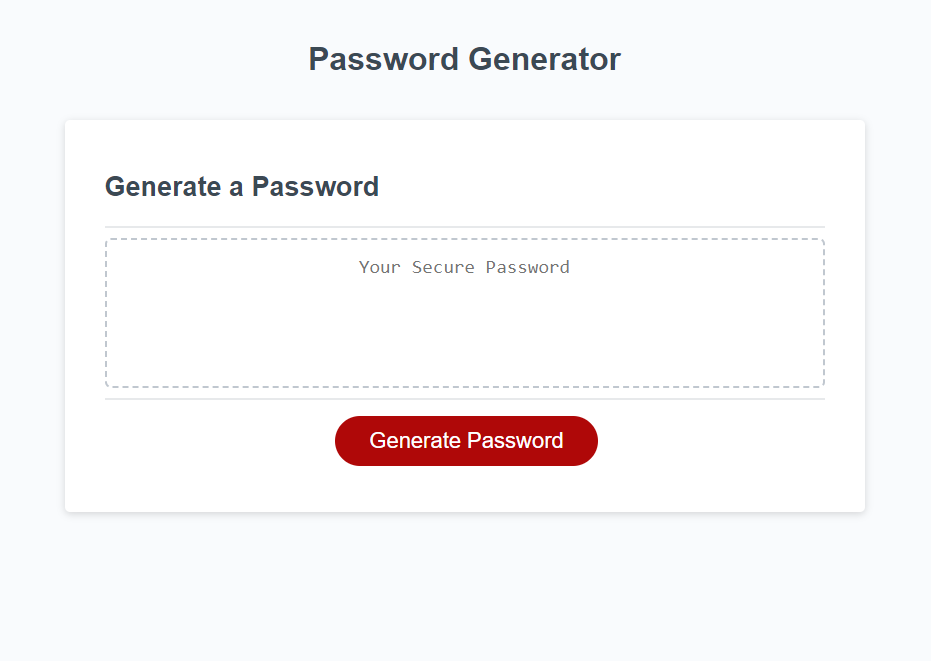

# Week 3 Homework - Password Generator

## Description

This website was created as a homework assignment for the University of Richmond coding boot camp. The task was to implement a password generation application in JavaScript from a prebuilt HTML and CSS framework. While working on this assignment, I learned about some of the intricacies of JavaScript syntax and mechanics and about creatively problem solving using JavaScript.

## Installation

N/A

## Usage

Visit the website at https://madchazo.github.io/HW3-password-generator/.
Click on the Generate Password button to start the generation process. You will then be prompted to enter a password length as an integer between 8 and 128 and confirm whether or not you'd like uppercase, lowercase, numeric, or special characters in your password. Then a random password will be generated to your specifications. Feel free to copy and paste it into a password manager of your choice.

## Credits

The HTML and CSS for this website, as well as a portion of the JavaScript, was provided by the University of Richmond coding boot camp. The actual password generation was implemented by me using JavaScript, but I used a few pieces of code found on the web to help me implement my generator as efficiently as possible. I referenced an answer by Rob M. on stackoverflow that taught me about using for...while to make sure that the user enters the correct type of data in the prompt. That answer may be found [here](https://stackoverflow.com/a/15047174). As I wanted to make sure my passwords were as close to random as possible while still including all required characters, I included a Fisher-Yates shuffle function for strings that I learned from Andy E on stackoverflow. That answer may be found [here](https://stackoverflow.com/a/3943985). Thanks so much to them for sharing their expertise with less experienced coders like myself!

## License

See the LICENSE file in the repo.
